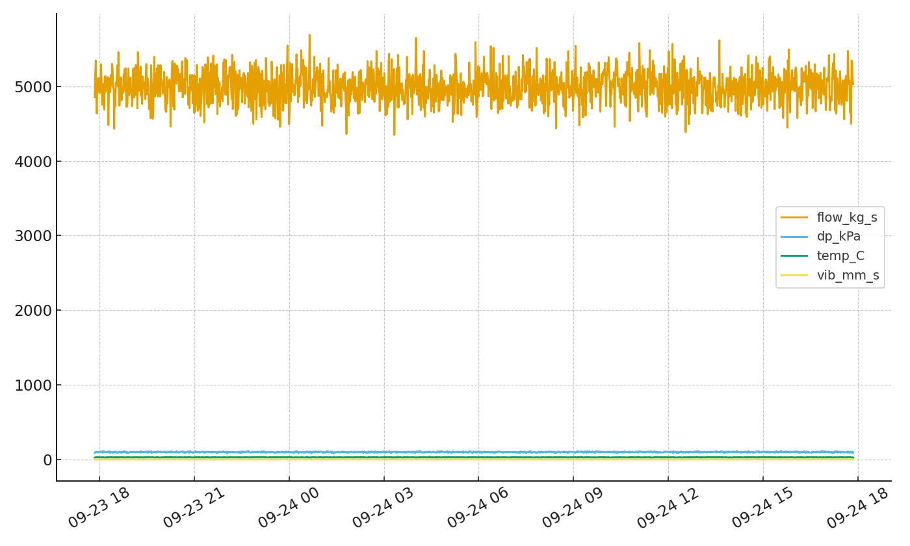
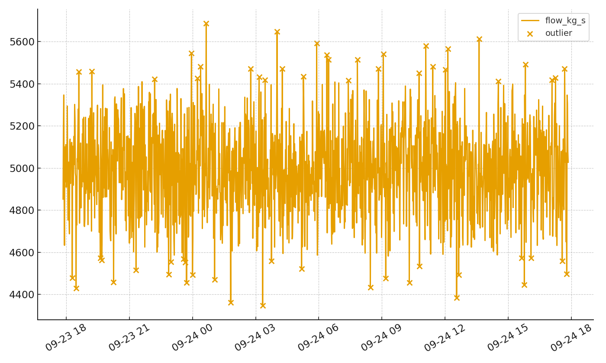

# System Health Monitor (Nuclear/Power Systems)

A concise, practical example of **system health monitoring** and **reliability analytics** for a balance‑of‑plant system (e.g., Service Water, Condenser Cooling). It demonstrates:
- KPI trending (availability, demand failures, maintenance deferrals)
- **Anomaly detection** on sensor time‑series (Isolation Forest)
- Simple **Weibull** fit for failure-time data to estimate hazard and remaining useful life (RUL)
- A minimal **Flask** dashboard that renders charts from CSV inputs

> Uses only mock/public data and generic logic

## Quick Start (no Docker)

```bash
python -m venv .venv && source .venv/bin/activate   # Windows: .venv\Scripts\activate
pip install -r requirements.txt
python scripts/generate_mock_data.py
python app.py
# open http://127.0.0.1:8000
```

## Quick Start (Docker)

```bash
docker build -t shm:latest .
docker run --rm -p 8000:8000 shm:latest
# open http://localhost:8000
```

## What you'll see
- **Home**: KPI cards (Availability, Demand Failures, Open WOs) + Last-24h chart  
- **Anomalies**: Outlier scatter on flow (last 24h)  
- **Reliability**: Weibull probability plot with fit (mock fallback if data sparse)

## Notes
- Headless plotting enforced via `MPLBACKEND=Agg`.
- Mock data generator is rerunnable and safe.

## Disclaimer
Illustrative use only; integrate with plant PI/Maximo/OSIsoft via appropriate security/governance when adapting for real sites.

---

## 👀 At a glance (Simple)
We “listen” to a plant system (flow, pressure, temperature, vibration) and:
- Show health **KPIs** (availability, demand failures, open work orders).
- **Spot anomalies** automatically.
- Estimate reliability with a **Weibull** fit for failure intervals.

## 🧠 How the code achieves it 
- `src/health/kpi.py` computes KPIs from raw time series and events.
- `src/health/anomaly.py` runs an Isolation Forest across multiple sensors to flag outliers.
- `app.py` serves charts (Flask). A small Weibull fit estimates shape/scale from inter-failure times.

## 🏷️ Badges


## 📸 Screenshots

<br>



